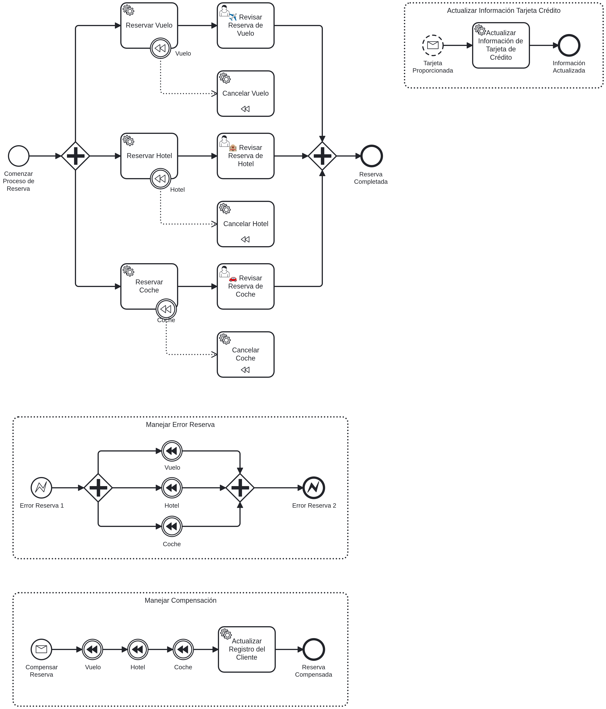
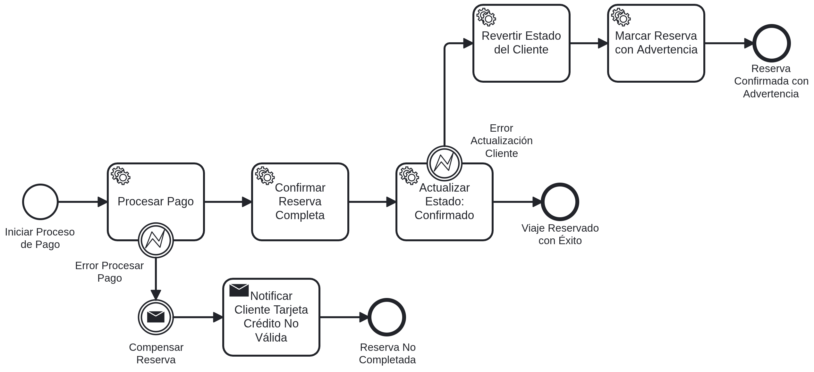

# 🌍 Sistema de Reservas de Viaje

[](https://openjdk.org/)
[](https://spring.io/projects/spring-boot)
[](https://camunda.com/)
[](LICENSE)

> Sistema empresarial de reservas de viajes construido con **arquitectura de microservicios**, **Camunda Platform 8** como orquestador BPMN, **arquitectura hexagonal**, y **Domain-Driven Design (DDD)**.

---

## 📋 Tabla de Contenidos

- [🎯 Descripción del Proyecto](#-descripción-del-proyecto)
- [✨ Características Principales](#-características-principales)
- [🏗️ Arquitectura](#️-arquitectura)
  - [Stack Tecnológico](#stack-tecnológico)
  - [Microservicios](#microservicios)
  - [Diagramas BPMN](#diagramas-bpmn)
- [📦 Requisitos Previos](#-requisitos-previos)
- [🚀 Instalación y Configuración](#-instalación-y-configuración)
- [💡 Uso del Sistema](#-uso-del-sistema)
- [📁 Estructura del Proyecto](#-estructura-del-proyecto)
- [🧪 Testing](#-testing)
- [🐳 Deployment](#-deployment)
- [🗺️ Roadmap y Versiones](#️-roadmap-y-versiones)
- [📚 Documentación Adicional](#-documentación-adicional)
- [🤝 Contribución](#-contribución)
- [📄 Licencia](#-licencia)

---

## 🎯 Descripción del Proyecto

Este sistema permite gestionar reservas completas de viajes, incluyendo:

- ✈️ **Reservas de vuelos**
- 🏨 **Reservas de hoteles**
- 🚗 **Alquiler de vehículos**
- 💳 **Procesamiento de pagos**
- 👥 **Gestión de clientes**

El sistema implementa un **patrón Saga** con compensaciones automáticas, asegurando consistencia eventual en transacciones distribuidas a través de múltiples microservicios.

---

## ✨ Características Principales

- 🎯 **Arquitectura Hexagonal** - Separación clara entre dominio, aplicación e infraestructura
- 🧩 **Domain-Driven Design** - Modelado explícito con JMolecules
- 🔄 **Orquestación BPMN** - Camunda Platform 8 como motor de workflows
- ⚡ **Procesamiento Paralelo** - Reservas simultáneas de vuelo, hotel y coche
- 🔁 **Patrón Saga** - Compensaciones automáticas en caso de error
- 📊 **Observabilidad** - Health checks, métricas y logs estructurados
- 🐳 **Containerización** - Docker y Docker Compose listos para producción
- 📖 **OpenAPI** - Documentación automática de APIs REST
- 🧪 **Testing Completo** - Unitarios, integración y arquitectura

---

## 🏗️ Arquitectura

### Visión General

El sistema sigue una arquitectura de microservicios donde **Camunda Platform 8** actúa como orquestador central, coordinando las operaciones a través de procesos BPMN.

<!-- 
📸 Insertar imagen aquí:

-->

### Stack Tecnológico

| Categoría | Tecnología | Versión | Propósito |
|-----------|-----------|---------|-----------|
| **Lenguaje** | Java | 21 | Desarrollo backend |
| **Framework** | Spring Boot | 3.5.6 | Framework base |
| **Orquestador** | Camunda Platform 8 | 8.7 | Motor de workflows BPMN |
| **Persistencia** | Spring Data JPA | - | Acceso a datos |
| **BD Desarrollo** | H2 Database | 2.3.232 | Base de datos en memoria |
| **Utilidades** | Lombok | 1.18.36 | Reducción de boilerplate |
| **Mapeo** | MapStruct | 1.6.3 | DTO ↔ Entity |
| **Validación** | Apache Commons Lang | 3.17.0 | Utilidades y validaciones |
| **DDD** | JMolecules | 1.10.0 | Anotaciones DDD |
| **API Docs** | SpringDoc OpenAPI | 2.7.0 | Documentación automática |
| **Frontend** | Vaadin | 24.5.7 | UI (v2.0) |
| **Containerización** | Docker | - | Despliegue |

### Microservicios

El sistema está compuesto por **6 microservicios independientes**:

| Puerto | Microservicio | Responsabilidad | Agregado DDD |
|--------|--------------|-----------------|--------------|
| **9080** | 👥 **servicio-clientes** | Gestión de clientes, validación de tarjetas, estados | `Cliente` |
| **9081** | ✈️ **servicio-vuelos** | Reservas y cancelaciones de vuelos | `ReservaVuelo` |
| **9082** | 🏨 **servicio-hoteles** | Reservas y cancelaciones de hoteles | `ReservaHotel` |
| **9083** | 🚗 **servicio-alquiler-coches** | Reservas y cancelaciones de vehículos | `ReservaAlquilerCoche` |
| **9084** | 💳 **servicio-pagos** | Procesamiento de pagos, confirmaciones | `Pago` |
| **9090** | 🎯 **servicio-reservas** | Coordinador BPMN (Agregado Raíz) | `ReservaViaje` |

**Infraestructura Camunda Platform 8:**

| Puerto | Componente | Acceso |
|--------|-----------|--------|
| **8080** | Camunda Operate | `http://localhost:8080` (demo/demo) |
| **8081** | Camunda Tasklist | `http://localhost:8081` (demo/demo) |
| **26500** | Zeebe gRPC | Workers se conectan aquí |

<!--
📸 Insertar imagen aquí:

-->

### Arquitectura Hexagonal

Cada microservicio implementa arquitectura hexagonal con separación clara de capas:

```
servicio-<nombre>/
├── dominio/              # 🟢 Lógica de negocio pura
│   ├── modelo/           # Entidades, Agregados, Value Objects
│   ├── evento/           # Eventos de dominio
│   └── servicio/         # Servicios de dominio
├── aplicacion/           # 🔵 Casos de uso
│   ├── dto/              # DTOs
│   ├── servicio/         # Application Services
│   └── puerto/           # Interfaces (Ports)
└── infraestructura/      # 🟡 Adaptadores
    ├── adaptador/
    │   ├── entrada/      # REST Controllers, Job Workers
    │   └── salida/       # JPA Repositories, HTTP Clients
    └── configuracion/    # Spring Configuration
```

<!--
📸 Insertar imagen aquí:

-->

### Diagramas BPMN

El sistema implementa **4 procesos BPMN** principales:

#### 🗺️ Proceso Principal

Coordina todo el flujo de reserva de viaje, desde la validación inicial hasta la confirmación de pago.

<!--
📸 Insertar imagen aquí:

-->

#### 👤 Subproceso: Gestión de Cliente

Valida la existencia del cliente y la validez de su tarjeta de crédito.

<!--
📸 Insertar imagen aquí:

-->

**Flujo:**
1. Obtener datos del cliente
2. Validar existencia del cliente
3. Validar tarjeta de crédito
4. Actualizar estado del cliente

#### 🎟️ Subproceso: Proceso de Reserva

Ejecuta reservas **paralelas** de vuelo, hotel y coche con soporte para compensaciones.

<!--
📸 Insertar imagen aquí:

-->

**Características:**
- ⚡ Reservas paralelas (Gateway paralelo)
- 🔁 Compensaciones automáticas en caso de error
- 👤 User Tasks para revisión manual
- 📝 Subproceso de actualización de tarjeta (no interrumpible)

#### 💳 Subproceso: Proceso de Pago

Procesa el pago y confirma la reserva completa.

<!--
📸 Insertar imagen aquí:

-->

**Flujo:**
1. Procesar pago
2. Confirmar reserva completa
3. Actualizar estado del cliente
4. En caso de error → Compensar reservas

---

## 📦 Requisitos Previos

Antes de comenzar, asegúrate de tener instalado:

- ☕ **Java 21** - [Descargar OpenJDK](https://openjdk.org/)
- 📦 **Maven 3.9+** - [Descargar Maven](https://maven.apache.org/)
- 🐳 **Docker** y **Docker Compose** - [Descargar Docker](https://www.docker.com/)
- 🔧 **Git** - [Descargar Git](https://git-scm.com/)

**Opcional:**
- 🎨 **Camunda Modeler** - Para visualizar/editar diagramas BPMN

---

## 🚀 Instalación y Configuración

### 1️⃣ Clonar el Repositorio

```bash
git clone https://github.com/tu-usuario/sistema-reservas-viaje.git
cd sistema-reservas-viaje
```

### 2️⃣ Levantar el Sistema Completo

El script `start.sh` levanta primero Camunda Platform 8 y luego los microservicios:

```bash
chmod +x start.sh
./start.sh
```

**El script realiza:**
1. 🚀 Levanta Camunda Platform 8 (Zeebe, Operate, Tasklist)
2. ⏳ Espera 60 segundos para que Camunda esté listo
3. 🏗️ Construye y levanta todos los microservicios

### 3️⃣ Verificar el Estado

Una vez iniciado, verifica que todo esté funcionando:

**Camunda Platform 8:**
- 📊 **Operate**: [http://localhost:8080](http://localhost:8080) (demo/demo)
- 📋 **Tasklist**: [http://localhost:8081](http://localhost:8081) (demo/demo)

**Microservicios:**
- 👥 Clientes: [http://localhost:9080/actuator/health](http://localhost:9080/actuator/health)
- ✈️ Vuelos: [http://localhost:9081/actuator/health](http://localhost:9081/actuator/health)
- 🏨 Hoteles: [http://localhost:9082/actuator/health](http://localhost:9082/actuator/health)
- 🚗 Coches: [http://localhost:9083/actuator/health](http://localhost:9083/actuator/health)
- 💳 Pagos: [http://localhost:9084/actuator/health](http://localhost:9084/actuator/health)
- 🎯 Reservas: [http://localhost:9090/actuator/health](http://localhost:9090/actuator/health)

**Documentación API (OpenAPI/Swagger):**
- 👥 Clientes: [http://localhost:9080/swagger-ui.html](http://localhost:9080/swagger-ui.html)
- ✈️ Vuelos: [http://localhost:9081/swagger-ui.html](http://localhost:9081/swagger-ui.html)
- etc...

---

## 💡 Uso del Sistema

### Iniciar una Reserva de Viaje

#### Opción 1: Desde Camunda Tasklist

1. Accede a [Camunda Tasklist](http://localhost:8081)
2. Inicia una nueva instancia del proceso "Travel Booking Scenario"
3. Completa el formulario con los datos del cliente
4. Sigue las tareas de usuario que aparezcan

#### Opción 2: Via API REST

```bash
# Iniciar proceso de reserva
curl -X POST http://localhost:9090/api/reservas/iniciar \
  -H "Content-Type: application/json" \
  -d '{
    "clienteId": "CLI-001",
    "origen": "Madrid",
    "destino": "Barcelona",
    "fechaInicio": "2025-12-01",
    "fechaFin": "2025-12-05"
  }'
```

### Datos de Prueba

El sistema incluye datos precargados para testing:

**Clientes válidos:**
- **Vicente Priego** - `CLI-001` - Tarjeta válida
- **Verónica Lesmes** - `CLI-002` - Tarjeta válida
- **Juan Pérez** - `CLI-003` - Tarjeta inválida (para probar errores)

**Escenarios de prueba:**
- ✅ **Flujo feliz**: Cliente CLI-001, todo correcto
- ❌ **Cliente no encontrado**: Cliente CLI-999
- ❌ **Tarjeta inválida**: Cliente CLI-003
- ❌ **Error en pago**: Monto > 10000 (simula error de pago)
- ⚠️ **Advertencia**: Monto entre 5000-10000 (genera advertencia pero confirma)

Ver más detalles en [📖 Casos de Uso](docs/casos-uso.md)

---

## 📁 Estructura del Proyecto

```
sistema-reservas-viaje/
├── 📄 README.md                           # Este archivo
├── 📋 ROADMAP.md                          # Plan de versiones
├── 📝 CHANGELOG.md                        # Historial de cambios
├── 🤝 CONTRIBUTING.md                     # Guía de contribución
├── 📜 LICENSE                             # Licencia MIT
│
├── 🗂️ bpmn/                               # Diagramas BPMN
│   ├── proceso-principal.bpmn
│   ├── subproceso-gestion-cliente.bpmn
│   ├── subproceso-proceso-reserva.bpmn
│   └── subproceso-pago.bpmn
│
├── 📚 docs/                               # Documentación detallada
│   ├── 📸 images/                         # Imágenes y diagramas
│   │   ├── arquitectura/
│   │   └── bpmn/
│   ├── 01-quick-start.md
│   ├── 02-arquitectura.md
│   ├── 03-instalacion.md
│   ├── 04-configuracion.md
│   ├── 05-procesos-bpmn.md
│   ├── 06-microservicios.md
│   ├── 07-testing.md
│   ├── 08-deployment.md
│   └── casos-uso.md
│
├── 🐳 docker/                             # Archivos Docker
│   ├── docker-compose-camunda.yml
│   └── docker-compose.yml
│
├── 🏗️ servicio-clientes/                 # Microservicio de Clientes
│   ├── src/main/java/dev/javacadabra/reservasviaje/cliente/
│   │   ├── aplicacion/
│   │   ├── dominio/
│   │   └── infraestructura/
│   ├── Dockerfile
│   └── pom.xml
│
├── ✈️ servicio-vuelos/                    # Microservicio de Vuelos
├── 🏨 servicio-hoteles/                   # Microservicio de Hoteles
├── 🚗 servicio-alquiler-coches/           # Microservicio de Coches
├── 💳 servicio-pagos/                     # Microservicio de Pagos
├── 🎯 servicio-reservas/                  # Coordinador BPMN
│
├── 🔧 start.sh                            # Script de inicio
└── 📦 pom.xml                             # Parent POM
```

---

## 🧪 Testing

El proyecto incluye múltiples niveles de testing:

### Tests Unitarios

```bash
# Ejecutar tests de un microservicio
cd servicio-clientes
mvn test
```

### Tests de Integración

```bash
# Tests de integración con Testcontainers
mvn verify -P integration-tests
```

### Tests de Arquitectura

```bash
# Validar cumplimiento de arquitectura hexagonal
mvn test -Dtest=ArchitectureTests
```

Ver más detalles en [📖 Guía de Testing](docs/07-testing.md)

---

## 🐳 Deployment

### Docker Compose (Desarrollo)

```bash
# Levantar todo el sistema
./start.sh

# Ver logs de un servicio específico
docker-compose logs -f servicio-clientes

# Detener todo
docker-compose down
```

### Kubernetes (Producción)

Ver [📖 Guía de Deployment](docs/08-deployment.md) para instrucciones completas de despliegue en Kubernetes.

---

## 🗺️ Roadmap y Versiones

### 📦 v1.0.0 - MVP (Rama: `main`) ✅

**Estado**: Completado

**Características:**
- ✅ Arquitectura base de microservicios
- ✅ Integración con Camunda Platform 8
- ✅ Procesos BPMN completos
- ✅ Patrón Saga con compensaciones
- ✅ APIs REST con OpenAPI
- ✅ Base de datos H2 en memoria
- ✅ Docker Compose

### 🎨 v2.0.0 - Frontend con Vaadin (Rama: `feature/vaadin-ui`) 🔄

**Estado**: En desarrollo

**Características planeadas:**
- 🔄 Interfaz de usuario con Vaadin 24.5
- 🔄 Dashboard de monitoreo de procesos
- 🔄 Formularios dinámicos
- 🔄 Integración con Zeebe REST API
- 🔄 Visualización de instancias de proceso en tiempo real

### 📊 v3.0.0 - Observabilidad Completa (Rama: `feature/observability`) 📋

**Estado**: Planificado

**Características planeadas:**
- 📋 Métricas con Micrometer + Prometheus
- 📋 Logs centralizados con ELK Stack
- 📋 Distributed tracing con Zipkin/Jaeger
- 📋 Dashboards con Grafana
- 📋 Alertas automatizadas

### 🔐 v4.0.0 - Seguridad y Autenticación (Rama: `feature/security`) 📋

**Estado**: Planificado

**Características planeadas:**
- 📋 Spring Security + OAuth2
- 📋 JWT para autenticación
- 📋 Roles y permisos
- 📋 API Gateway con Spring Cloud Gateway

Ver [ROADMAP.md](ROADMAP.md) completo para más detalles.

---

## 📚 Documentación Adicional

- 📖 [Quick Start](docs/01-quick-start.md) - Guía rápida de inicio
- 🏗️ [Arquitectura Detallada](docs/02-arquitectura.md) - Decisiones arquitectónicas
- 🔧 [Instalación Completa](docs/03-instalacion.md) - Instalación paso a paso
- ⚙️ [Configuración](docs/04-configuracion.md) - Variables y ajustes
- 📊 [Procesos BPMN](docs/05-procesos-bpmn.md) - Documentación de workflows
- 🛠️ [Microservicios](docs/06-microservicios.md) - Detalle de cada servicio
- 🧪 [Testing](docs/07-testing.md) - Estrategia de testing
- 🐳 [Deployment](docs/08-deployment.md) - Guía de despliegue
- 💡 [Casos de Uso](docs/casos-uso.md) - Ejemplos de uso

---

## 🤝 Contribución

¡Las contribuciones son bienvenidas! Por favor lee [CONTRIBUTING.md](CONTRIBUTING.md) para detalles sobre nuestro código de conducta y el proceso para enviar pull requests.

### Proceso de Contribución

1. 🍴 Fork el proyecto
2. 🔀 Crea una rama para tu feature (`git checkout -b feature/AmazingFeature`)
3. 💾 Commit tus cambios (`git commit -m '✨ Add some AmazingFeature'`)
4. 📤 Push a la rama (`git push origin feature/AmazingFeature`)
5. 🔃 Abre un Pull Request

---

## 📄 Licencia

Este proyecto está licenciado bajo la Licencia MIT - ver el archivo [LICENSE](LICENSE) para más detalles.

---

## 👥 Autores

- **Tu Nombre** - *Trabajo inicial* - [tu-usuario](https://github.com/tu-usuario)

---

## 🙏 Agradecimientos

- Camunda Community por la excelente documentación
- Spring Boot Team por el framework
- Comunidad de Domain-Driven Design
- Todos los contribuidores del proyecto

---

## 📞 Contacto

- 📧 Email: tu-email@example.com
- 💼 LinkedIn: [tu-perfil](https://linkedin.com/in/tu-perfil)
- 🐦 Twitter: [@tu-usuario](https://twitter.com/tu-usuario)

---

<div align="center">

**⭐ Si este proyecto te resulta útil, considera darle una estrella ⭐**

Made with ❤️ by [Tu Nombre]

</div>
